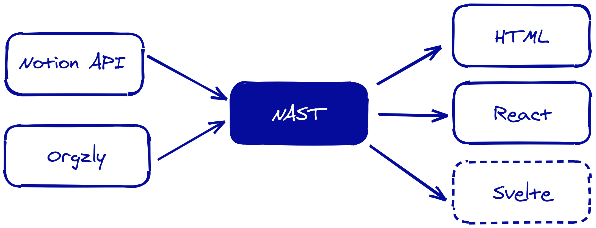

# NAST

A block-based intermediate representation for document-like content.



## Packages

| Name                                                         | Description                                                  | Status           |
| :----------------------------------------------------------- | :----------------------------------------------------------- | :--------------- |
| [nast-types](./packages/nast-types)                                               | A TypeScript type definition module to specify data models for intermediate representation of data. | Experimental     |
| [nast-util-from-notionapi](./packages/nast-util-from-notionapi) | Import data from a [Notion](https://www.notion.so/) page.    | Experimental     |
| [nast-util-from-orgzly](./packages/nast-util-from-orgzly)    | Import data from an org-mode file exported by [Orgzly](http://www.orgzly.com/). | Proof of Concept |
| [nast-util-to-html](./packages/nast-util-to-html)            | Render data to HTML. (Deprecated)                            | Experimental     |
| [nast-util-to-react](./packages/nast-util-to-react)          | Render data to `JSX.Element` or HTML. (Preferred)            | Experimental     |
| nast-util-to-svelte                                          | Render data to HTML using Svelte.                            | -                |

* Stability : **Stable** > **Experimental** > **Proof of Concept**

## Development

### Clone the repo and `cd` into it

```bash
git clone https://github.com/dragonman225/nast.git && cd nast
```

### Install dependencies

* `lerna` (required)

  ```bash
  npm i -g lerna
  ```

  This project uses [lerna](https://github.com/lerna/lerna) to manage the monorepo. If you haven't used it before, [this tutorial](https://github.com/reggi/lerna-tutorial) is a good start point.

* `typedoc` (optional)

  ```bash
  npm i -g typedoc
  ```

  `typedoc` needs to be available in the command-line for reference document generation.

* [Graphviz](https://www.graphviz.org/) (optional)

  ```bash
  pacman -S graphviz # For Arch Linux
  ```

  `dot` needs to available in the command-line for dependency graph generation.

### Run setup

A shell script is prepared for you. It will bootstrap the dependencies of the packages and run the first build for those that need to be built.

```bash
./bootstrap.sh
```

### Testing

* Test the overall functionality with `npdl`.

  Download a Notion page and render it to HTML. Use the CSS theme at `packages/nast-util-to-react/test/theme.css`.

  ```bash
  node packages/npdl/index.js -i=<notion_page_url> output.html
  ```

  Use an external theme.

  ```bash
  node packages/npdl/index.js -i=<notion_page_url> --theme=<path_to_css> output.html
  ```

  Just download a Notion page without rendering to HTML.

  ```bash
  node packages/npdl/index.js -i=<notion_page_url> --tree output.json
  ```

  `npdl` has more features, which can be listed with

  ```bash
  node packages/npdl/index.js
  ```

  You can also install `npdl` globally.

  ```bash
  cd packages/npdl && npm i -g .
  ```

* Each package may have its own test suite, which is not covered here.

### Contributing to NAST

* [Contributing to the project](CONTRIBUTING.md)