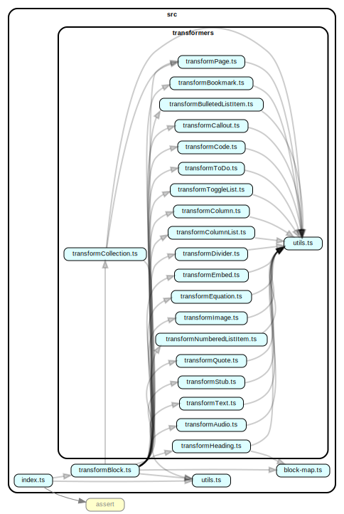

# nast-util-from-notionapi

   

Convert a Notion.so page into a tree object, using Notion's API.

For related projects, please see the topic [notajs](https://github.com/topics/notajs).

## Documentation

* [Usage](#Usage)
* [Example](#Example)
* [API Reference](#API-Reference)
* [Notes](#Notes)

## Usage

```bash
npm i nast-util-from-notionapi
```

Also need [`notionapi-agent`](https://github.com/dragonman225/notionapi-agent) to retrieve raw data from Notion's API.

```bash
npm i notionapi-agent
```

`require` this module,

```javascript
const { getOnePageAsTree, getAllBlocksInOnePage } = require('nast-util-from-notionapi')
```

## Example

```javascript
const fs = require('fs')

const NotionAgent = require('notionapi-agent')
const { getOnePageAsTree, getAllBlocksInOnePage } = require('nast-util-from-notionapi')

/* Configure NotionAgent's options */
const options = {
  token: '',
  suppressWarning: false,
  verbose: true
}
const agent = new NotionAgent(options)

async function main() {
  try {
    /* Fill in a page ID */
    let pageID = ''
    let tree = await getOnePageAsTree(pageID, agent)
    let rawBlocks = await getAllBlocksInOnePage(pageID, agent)
    fs.writeFileSync(
        `PageTree-${pageID}.json`,
        JSON.stringify(tree),
        { encoding: 'utf-8' }
    )
    fs.writeFileSync(
        `RawBlocks-${pageID}.json`,
        JSON.stringify(rawBlocks),
        { encoding: 'utf-8' }
    )
  } catch (error) {
    console.error(error)
  }
}

main()
```

## API Reference

### `async` `getOnePageAsTree(pageID, agent)`

Download a page as a tree object in an easier-to-work-with format.

* `pageID` - (required) The ID of a Notion page. It must be the one with dashes as below :
  
  ```
  cbf2b645-xxxx-xxxx-xxxx-xxxxe8cfed93
  ```

* `agent` - (required) A [`Notion.NotionAgent`](https://github.com/dragonman225/notionapi-agent/blob/e69b59cad90ed5daf1eec1b5819f07b426ec29b7/src/index.ts#L438) instance. Either from [`notionapi-agent`](https://github.com/dragonman225/notionapi-agent) package or a compatible implementation.

#### Returns :

A tree consists of [`Nast.Block`](https://github.com/dragonman225/nast-util-from-notionapi/blob/635c79c8f3a9308321532d3d9f09b8e68015c15a/src/nast.ts#L19) nodes.

```typescript
interface Nast.Block {
  id: string
  type: string
  color?: string
  createdTime: number
  lastEditedTime: number
  children: Nast.Block[]
}
```

### `async` `getAllBlocksInOnePage(pageID, agent)`

Download all blocks of a page in Notion's record format.

Function parameters are the same as `getOnePageAsTree`.

#### Returns :

[`Notion.Record[]`](https://github.com/dragonman225/notionapi-agent/blob/e69b59cad90ed5daf1eec1b5819f07b426ec29b7/src/index.ts#L127), with `value` property of every `Notion.Record` being [`Notion.Block`](https://github.com/dragonman225/notionapi-agent/blob/e69b59cad90ed5daf1eec1b5819f07b426ec29b7/src/index.ts#L165)

```typescript
[
  {
    role: string
    value: Notion.Block
  }
]
```

## Notes

### Code Structure

Generated by `dependency-cruiser` NPM package.

