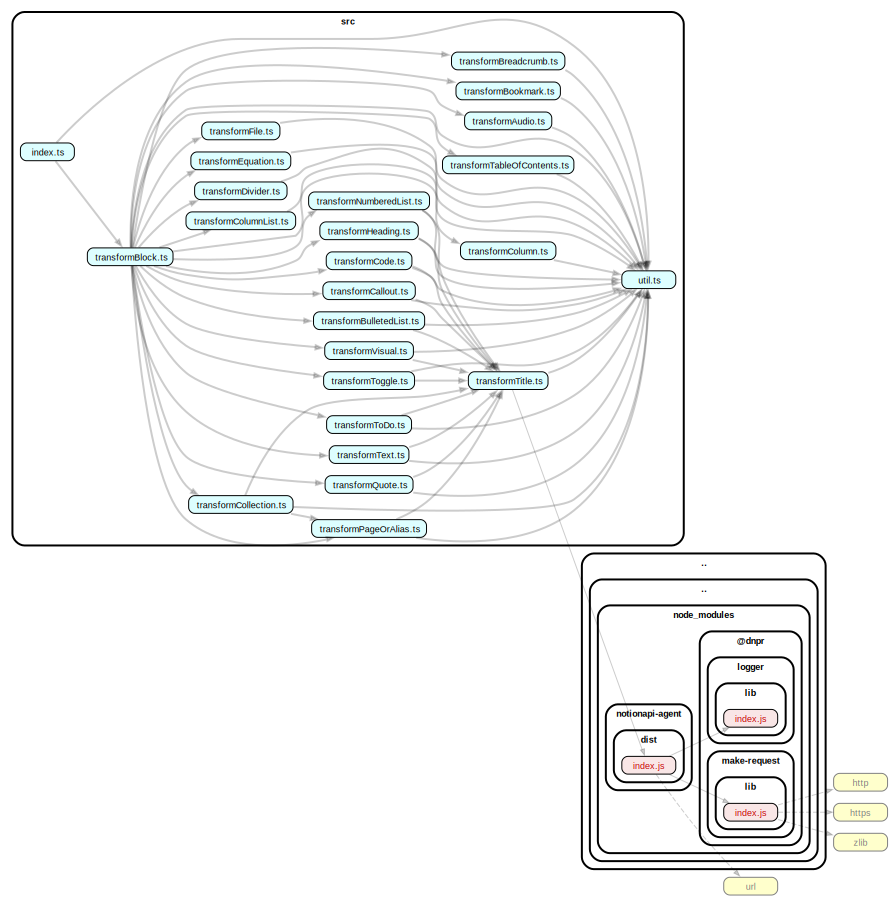

# nast-util-from-notionapi

   

Convert Notion.so pages into NAST representation, using Notion's API.

## Documentation

* [Usage](#Usage)
* [Example](#Example)
* [API Reference](#API-Reference)
* [Notes](#Notes)

## Usage

```bash
npm i nast-util-from-notionapi
```

Also need [`notionapi-agent`](https://github.com/dragonman225/notionapi-agent) to retrieve raw data from Notion's API.

```bash
npm i notionapi-agent
```

`require` this module,

```javascript
const { getOnePageAsTree, getAllBlocksInOnePage } = require('nast-util-from-notionapi')
```

## Example

```javascript
const fs = require('fs')

const NotionAgent = require('notionapi-agent')
const { getOnePageAsTree, getAllBlocksInOnePage } = require('nast-util-from-notionapi')

/* Configure NotionAgent's options */
const options = {
  token: '',
  suppressWarning: false,
  verbose: true
}
const agent = new NotionAgent(options)

async function main() {
  try {
    /* Fill in a page ID */
    let pageID = ''
    let tree = await getOnePageAsTree(pageID, agent)
    let rawBlocks = await getAllBlocksInOnePage(pageID, agent)
    fs.writeFileSync(
        `PageTree-${pageID}.json`,
        JSON.stringify(tree),
        { encoding: 'utf-8' }
    )
    fs.writeFileSync(
        `RawBlocks-${pageID}.json`,
        JSON.stringify(rawBlocks),
        { encoding: 'utf-8' }
    )
  } catch (error) {
    console.error(error)
  }
}

main()
```

## API Reference

### `async` `getOnePageAsTree(pageID, agent)`

Download a page as a tree object in an easier-to-work-with format.

* `pageID` - (required) The ID of a Notion page. It must be the one with dashes as below :
  
  ```
  cbf2b645-xxxx-xxxx-xxxx-xxxxe8cfed93
  ```

* `agent` - (required) A [`notionapi-agent`-compatible](https://github.com/dragonman225/notionapi-agent/blob/35f406f418760536a3da8c336411a3b770ede598/src/agent.ts#L32) instance. You can just use the [`notionapi-agent`](https://github.com/dragonman225/notionapi-agent) package.

#### Returns :

A tree consists of [`NAST.Block`](https://github.com/dragonman225/nast/blob/5574180d3d36e77148c66d8608ec77c294ae817f/packages/nast-types/index.d.ts#L12) nodes.

```typescript
interface NAST.Block {
  uri: URI
  type: string
  color?: string
  createdTime: TimestampNumber
  lastEditedTime: TimestampNumber
  children: NAST.Block[]
}
```

### `async` `getAllBlocksInOnePage(pageID, agent)`

Download all blocks of a page in Notion's record format.

Function parameters are the same as `getOnePageAsTree`.

#### Returns :

[`Notion.BlockRecord[]`](https://notionapi.netlify.app/globals.html#blockrecord), where the `role` property of every `Notion.BlockRecord` being a [Notion.Role](https://notionapi.netlify.app/modules/permission.html#role), and `value` property of every `Notion.BlockRecord` being a [Notion.Block](https://notionapi.netlify.app/modules/block.html)

```typescript
[
  {
    role: Notion.Role
    value: Notion.Block
  }
]
```

## Notes

### Code Structure

Generated by `dependency-cruiser` NPM package.



### Notice

Before NAST is redesigned to have better representation of links and references, `alias` blocks (created by "Link to page" since some day in June or July, 2021) are dereferenced to `page` blocks, `transclusion_container` block and `transclusion_reference` block are dereferenced to their content.