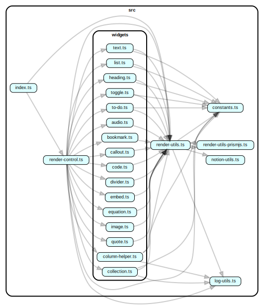

# nast-util-to-html

    

Render NAST to HTML.

NAST is an universal data structure to represent almost any document. It is under active development so there's no released documentation, but TypeScript definitions can be found [here](https://github.com/dragonman225/notajs-types).

This repo is part of [notajs project](https://github.com/topics/notajs).

A [demo page](https://nota.netlify.com/test.html) built with [nast-util-from-notionapi](https://github.com/dragonman225/nast-util-from-notionapi).

## Documentation

* [Usage](#Usage)
* [Example](#Example)
* [API Reference](#API-Reference)
* [Notes](#Notes)

## Usage

```bash
npm i nast-util-to-html
```

`require` this module,

```javascript
const { renderToHTML } = require('nast-util-to-html')
```

## Example

Download a Notion.so page and convert to HTML.

```javascript
const fs = require('fs')

const NotionAgent = require('notionapi-agent')
const { getOnePageAsTree } = require('nast-util-from-notionapi')
const { renderToHTML } = require('nast-util-to-html')

/* Configure NotionAgent's options */
const agentOpts = {
  token: '',
  suppressWarning: false,
  verbose: true
}
const agent = new NotionAgent(options)

async function main() {
  try {
    /* Fill in a Notion.so page ID */
    let pageID = ''
    let tree = await getOnePageAsTree(pageID, agent)
    let html = renderToHTML(tree)
    fs.writeFileSync(
        'index.html',
        html,
        { encoding: 'utf-8' }
    )
  } catch (error) {
    console.error(error)
  }
}

main()
```

## API Reference

### `renderToHTML(data, options)`

Render static HTML from NAST.

* `data` - (required) `Nast.Block` [Go to Definition](https://github.com/dragonman225/notajs-types/blob/09d537b220cf8620e8caaa31fd78eaced0ed347a/nast.d.ts#L20) |  `Notion.StyledString[]`[Go to Definition](https://github.com/dragonman225/notajs-types/blob/09d537b220cf8620e8caaa31fd78eaced0ed347a/notion.d.ts#L335)

* `options` - (optional) `RenderOptions`

  ```typescript
  type RenderOptions = {
    /** Ignore the root node */
    contentOnly: boolean
    /** Skip bulleted list and numbered list analysis */
    bypassPreRenderTransform: boolean
  }
  ```

#### Returns :

A HTML string.

## Notes

### Supported Blocks (for Notion.so)

#### Fundamental

- [x] Block Color
- [x] Column & Column List

#### Basic Blocks

- [x] Text
  - [x] Color & Background
  - [x] Style : Bold, Italic, Strike, Code, Link
  - [x] Nested
- [ ] Embedded Sub-page
- [x] Heading 1, 2, 3
- [x] Bulleted List
- [x] Numbered List
- [x] Toggle List
- [x] Quote
- [x] Divider
- [x] Callout
#### Inline

- [ ] Mention a Person (Directly renders `id` of the user)
- [ ] Mention a Page (Directly renders `id` of the page)
- [ ] Date or Reminder (Directly renders raw data)

#### Database

- [ ] Table
- [x] Gallery
- [ ] List
- [ ] Calendar
- [ ] Board

#### Media

- [x] Image
- [x] Web Bookmark
- [x] Video
- [x] Audio
- [x] Code
- [ ] File

#### Advanced Blocks

- [ ] Table of Contents
- [x] Math Equation
- [ ] Template Button
- [ ] Breadcrumb

### Code Structure

Generated by `dependency-cruiser` NPM package.

